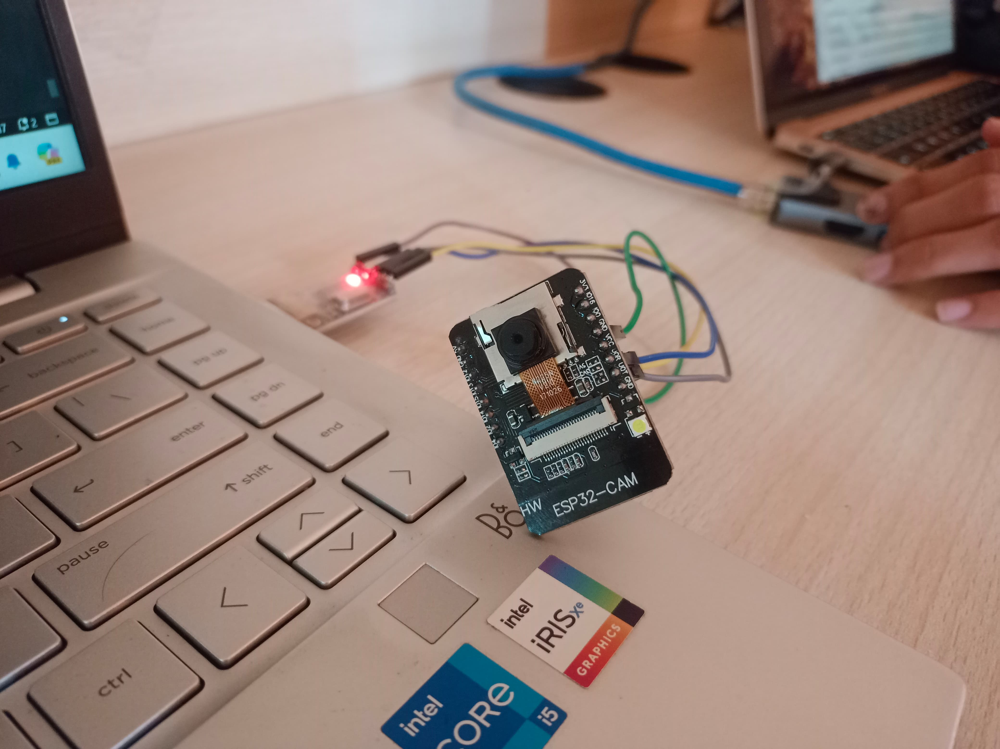
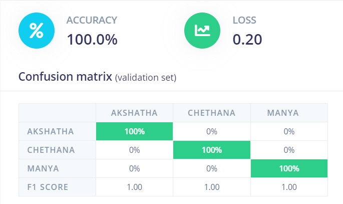
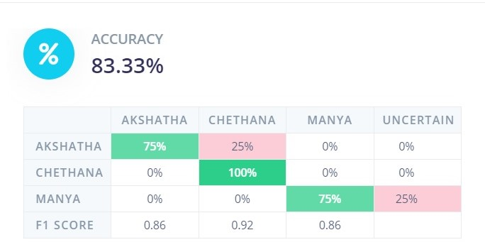
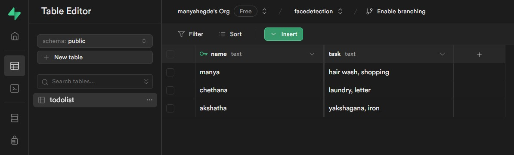
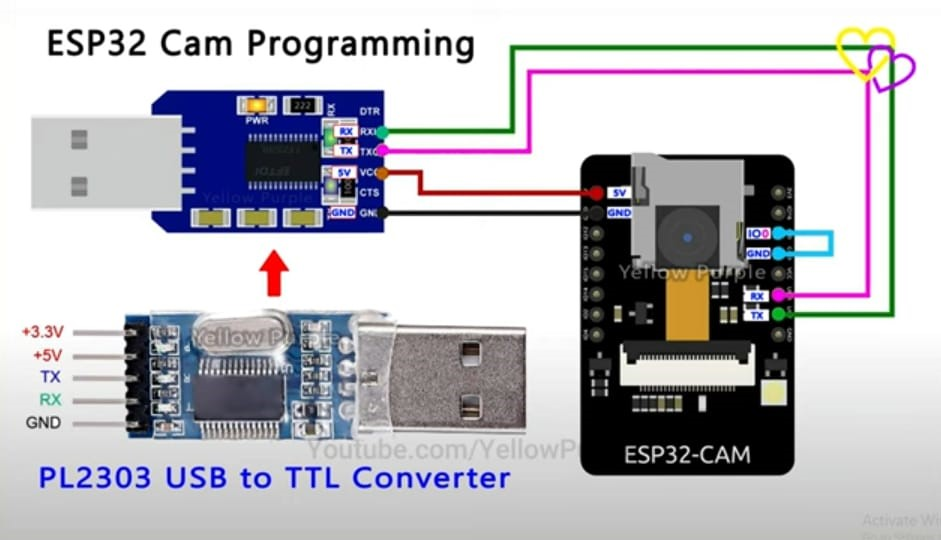
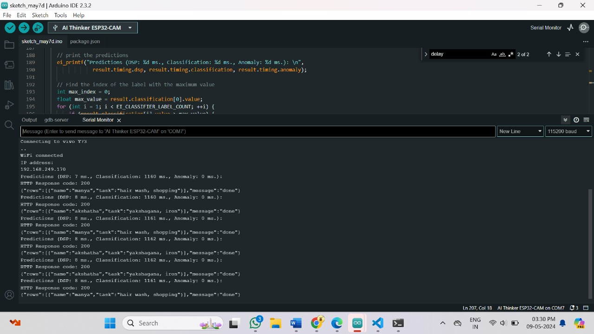

# Personalized Face Recognition and Task Management System

This project is an IoT application that utilizes face recognition to display personalized to-do lists for different individuals. The system detects the user's face and displays their specific to-do list.

## Requirements

- Arduino IDE
- USB to TTL Converter Adapter
- ESP32-CAM module
- Edge Impulse account
- Supabase account

## Training the Face Detection Model

1. Use Edge Impulse to train the face detection model using real-time photos.
2. For this project, the model is trained for 3 faces only using transfer learning and MobileNet.

#### Model Training Output

#### Model Testing Output

## Building and Adding the Model to Arduino IDE

1. After training, download the model which will be in a zip file format.
2. Add the zip file to the Arduino IDE.

## Setting up the To-Do List Database

1. Create a database in Supabase for the to-do list.
2. Tasks can be updated or deleted directly in Supabase.

## Connections

- Connect the ESP32-CAM module with the ESP32 development board.
- Connect the external display to the ESP32 board for displaying the to-do list.

## Usage

1. As the system detects a face, it matches it to a pre-trained face and displays the corresponding to-do list.
2. Users can update or delete tasks in the to-do list directly from the Supabase database.

## Output

This can be displayed on external displays like an LCD as well, but for this project, we have displayed it in the serial monitor.
